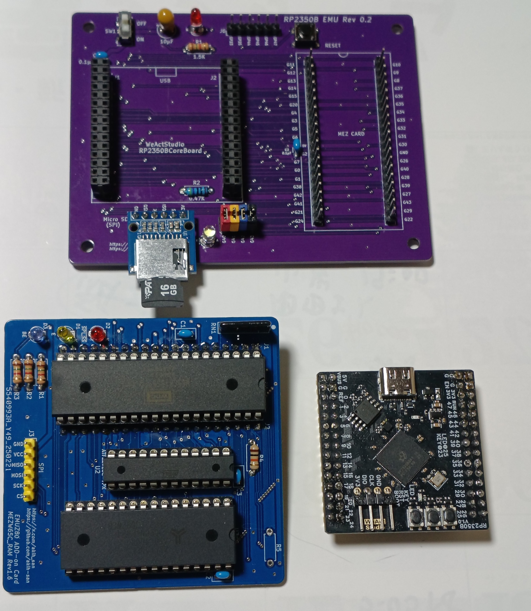
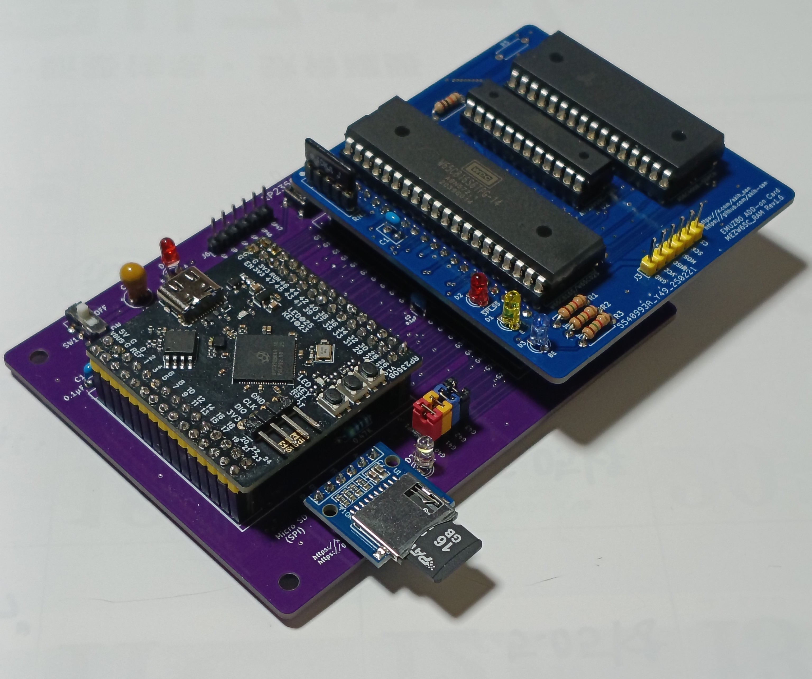

# RP2350B EMU board

RP2350B EMU board Rev 0.2は[EMUZ80](https://vintagechips.wordpress.com/2022/03/05/emuz80_reference/)ボード上で動作している
メザニンボードをRaspberry pi RP2350Bで動かしてみようと、作ったEMUボードです。 
Raspberry pi pico/pico2は、EMUZ80に使われているPIC18F47/57Q43/Q83/Q84に比べると、ポート(GPIO)数が少なく
メザニンボードを制御することが出来ないため、[WeActStudio.RP2350BCoreBoard](https://github.com/WeActStudio/WeActStudio.RP2350BCoreBoard)を用いました。
 
制御用のマイコンが変わる為、ファームウェア（FW）を作り直す必要があります。[EMUZ80](https://vintagechips.wordpress.com/2022/03/05/emuz80_reference/)で、[Z80](https://github.com/akih-san/EMUZ80PIC_SD)、[8088](https://github.com/akih-san/MEZ88_RAM)、[8086](https://github.com/akih-san/MEZ86_RAM)、[6520/816](https://github.com/akih-san/MEZW65C_RAM-Rev2.1G)、[60008](https://github.com/akih-san/FUZIX-for-MEZ68K8_RAM-Rev2.1)用のFWを作成してきましたが、
### RP2350B EMU board用として、MEZW65C_RAM Rev1.6用のFWを作成してみました。
 
## (2026/5/1) W65C816S issue
W65C816Sが動作が不安定な問題が発生しています。この件に関して原因を特定することが出来ました。詳細については、[こちら](https://x.com/akih_san/status/2042475788587712836)
この問題を解決するためには、基板を改版する必要があります。したがって、RP2350B EMU board Rev 0.2ではW65C02Sのみが正常に動作します。

### （RP2350B EMU board）
 

### （RP2350B and MEZW65C_RAM）
 
 
 

# Firmware Rev1.0 for MEZW65C_RAM Rev1.6

### MEZW65C_RAM Rev1.6の詳細ついては、[MEZW65C_RAM-Rev2.1G](https://github.com/akih-san/MEZW65C_RAM-Rev2.1G)を見てください。 
#### 起動画面は[こちら](photos/起動画面.png)

## 機能変更と追加したファイル

- PICO02.CFG、PICO16.CFGを追加 
MEZW65C_RAMへの供給クロックの周波数設定用のファイルとして、MEZW02.CFG、MEZW16.CFGがありますが、
RP2350B EMU board用として、新たにPICO02.CFG、PICO16.CFGを追加しました。
- NMI発生のキー入力 
PIC用のFWでは、CTL_Qを入力することでNMIを発生しましたが、CTL_Qを使用しているプログラムでCTL_Qが効かなくなるため、
CTL_Qを2回連続で入力することで、NMIを発生するように変更しました。
- CPLD(ATMEL F220V10C)のタイミングを若干変更しました。 
3.3Vの入力をCPLDで受けるために、動作タイミングを若干変更しました（PLD1.6) 
MEZW65C_RAM.jedを書込んでください。従来のPLD1.5のままでも問題ないと思われますが・・・気分です(笑)
 

# 参考
RP2350B EMU boardのFWを作成するときに、参考にしたサイトや書籍 

- [Raspberry pi pico/pico2 The C/C++ SDK](https://www.raspberrypi.com/documentation/microcontrollers/c_sdk.html)
- [Ｃ言語を使った高精度な組み込みシステム　ラズパイPicoベアメタル開発完全ガイド](https://www.amazon.co.jp/%EF%BC%A3%E8%A8%80%E8%AA%9E%E3%82%92%E4%BD%BF%E3%81%A3%E3%81%9F%E9%AB%98%E7%B2%BE%E5%BA%A6%E3%81%AA%E7%B5%84%E3%81%BF%E8%BE%BC%E3%81%BF%E3%82%B7%E3%82%B9%E3%83%86%E3%83%A0-%E3%83%A9%E3%82%BA%E3%83%91%E3%82%A4Pico%E3%83%99%E3%82%A2%E3%83%A1%E3%82%BF%E3%83%AB%E9%96%8B%E7%99%BA%E5%AE%8C%E5%85%A8%E3%82%AC%E3%82%A4%E3%83%89-%E7%B1%B3%E7%94%B0-%E8%81%A1-ebook/dp/B0FPDVJ626?ref_=ast_author_mpb)
- PIOつくし（準備号）「Norihiro Kumagai氏](https://github.com/tendai22)
- [ちょっとTea　Time!? PICO repeating_timerの憂鬱【備忘録】](http://www.easyaudiokit.com/bekkan2025/TeaTime2025/pico_repeating_timer/timernewpage2.html)
- [Raspberry Pi Pico C/C++ インターバルタイマ割り込みを試してみる](https://qiita.com/keyyum/items/3ce448c098c546dced20)
- [Raspberry Pi PicoでPWM出力](https://rikei-tawamure.com/entry/2021/02/08/213335)
- [5V系・3.3V系信号レベル変換](https://www.cepstrum.co.jp/hobby/5v33v/5v33v.html)
- [FatFs library for Raspberry Pi Pico / Pico 2](https://github.com/elehobica/pico_fatfs)

# 謝辞
このボードを作成するに至った経緯は、[DragonBallEZ氏](https://github.com/kyo-ta04/)の[Super AKI-80の組み立て方](https://note.com/quiet_duck4046/n/n32906e1dfb96?sub_rt=share_sb)と、[Pico2ROMEmu_PCB](https://github.com/kyo-ta04/Pico2ROMEmu_PCB)がきっかけで、Raspberry pi pico/pico2に興味が湧いたことからはじまります。 
[Norihiro Kumagai氏](https://github.com/tendai22)の[emuz80_pico2](https://github.com/tendai22/emuz80_pico2)は非常に参考になりました。 
### 参考にしたサイトと共に、とても感謝しています。

