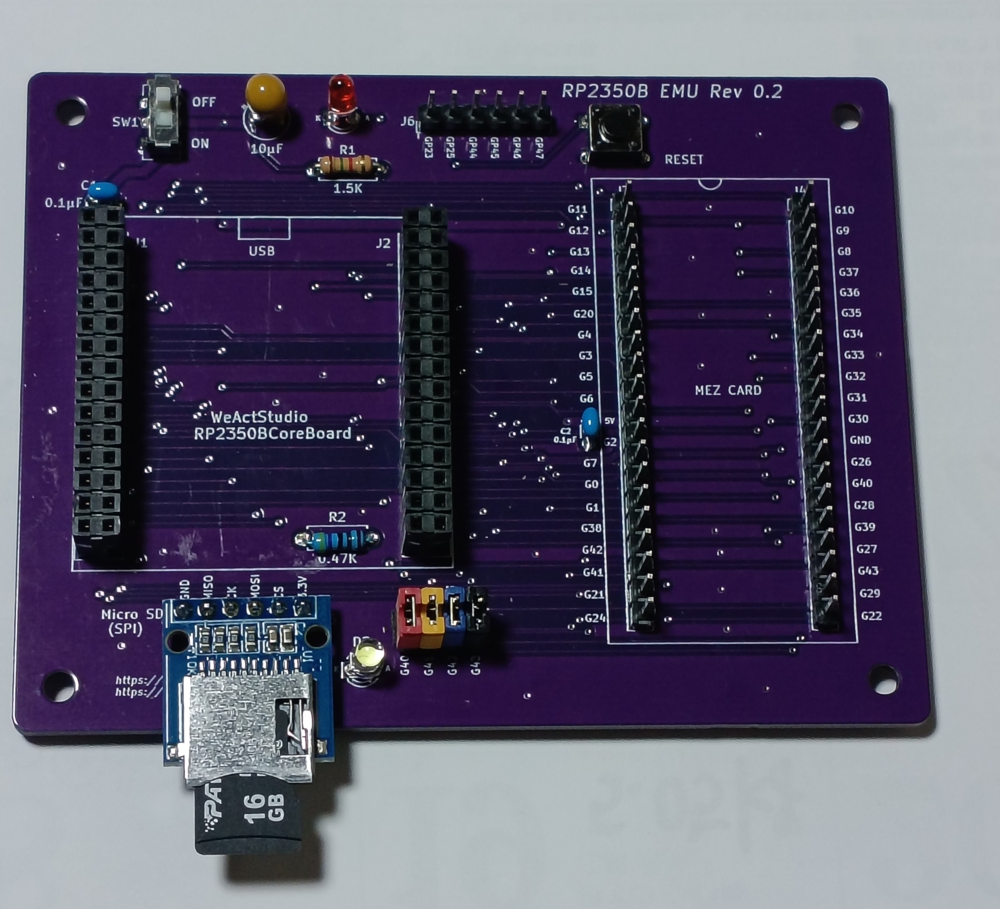

Under construction

# RP2350B EMU board

RP2350B EMU board Rev 0.2は[EMUZ80](https://vintagechips.wordpress.com/2022/03/05/emuz80_reference/)ボード上で動作している
メザニンボードをRaspberry pi RP2350Bで動かしてみようと、作ったEMUボードです。 
Raspberry pi pico/pico2は、EMUZ80に使われているPIC18F47/57Q43/Q83/Q84に比べると、ポート(GPIO)数が少なく
メザニンボードを制御することが出来ないため、[WeActStudio.RP2350BCoreBoard](https://github.com/WeActStudio/WeActStudio.RP2350BCoreBoard)を用いました。

# Firmware Rev1.0 for MEZW65C_RAM Rev1.6

制御用のマイコンが変わる為、ファームウェア（FW）を作り直す必要があります。[EMUZ80](https://vintagechips.wordpress.com/2022/03/05/emuz80_reference/)で、[Z80](https://github.com/akih-san/EMUZ80PIC_SD)、[8088](https://github.com/akih-san/MEZ88_RAM)、[8086](https://github.com/akih-san/MEZ86_RAM)、[6520/816](https://github.com/akih-san/MEZW65C_RAM-Rev2.1G)、[60008](https://github.com/akih-san/FUZIX-for-MEZ68K8_RAM-Rev2.1)用のFWを作成してきましたが、
RP2350B EMU board用として、MEZW65C_RAM Rev1.6用のFWを作成してみました。

（RP2350B EMU board） 

 

